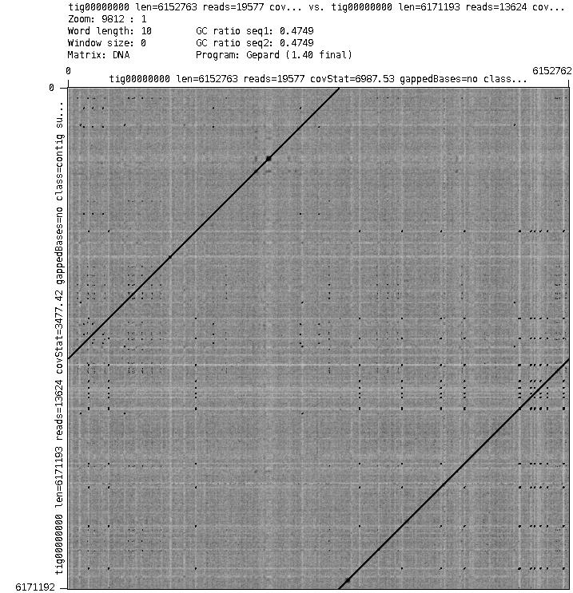

# 第三代测序基因组组装及注释（PacBio序列）  

## 实践内容  
1. 基于第三代测序数据（PacBio）基因组组装  
2. 基因组注释  

## 要求  
1. 了解第三代测序PacBio数据基因组组装基本原理，掌握canu和mecat组装流程
2. 要求掌握细菌基因组基因组注释流程

## 数据  
```
# 原始测序存放在：
/bs1/data/NGS/pacbio

[wangys@c1 pacbio]$ ll /bs1/data/NGS/pacbio
total 15045772
-rw-r--r--. 1 wangys wangys 5640540317 Apr 22 12:27 m170309_165401_42221_c101149812550000001823255607191754_s1_p0.1.bax.h5
-rw-r--r--. 1 wangys wangys  445711165 Apr 22 12:27 m170309_165401_42221_c101149812550000001823255607191754_s1_p0.1.subreads.fastq
-rw-r--r--. 1 wangys wangys 4212270498 Apr 22 12:29 m170309_165401_42221_c101149812550000001823255607191754_s1_p0.2.bax.h5
-rw-r--r--. 1 wangys wangys  508932544 Apr 22 12:29 m170309_165401_42221_c101149812550000001823255607191754_s1_p0.2.subreads.fastq
-rw-r--r--. 1 wangys wangys 4157080944 Apr 22 12:30 m170309_165401_42221_c101149812550000001823255607191754_s1_p0.3.bax.h5
-rw-r--r--. 1 wangys wangys  427212843 Apr 22 12:30 m170309_165401_42221_c101149812550000001823255607191754_s1_p0.3.subreads.fastq
```

说明： 含有两种格式的数据，一类是fastq序列，一类是h5数据，组装我们用的是fastq数据，最后用quiver打磨(polish)基因组时要用到h5数据。

## 上机操作  

### 1. 准备工作目录和数据  

```
$ mkdir work #我以work目录为例，大家自己建一个自己的工作目录，注意，后面的目录名也要作相应改变
$ cd work
$ mkdir data assem annotation
$ ln -s /bs1/data/NGS/pacbio/* data/

```
### 2. 组装
**canu组装流程**

```
# 回到工作目录
$ cd assem
# 新建一个工作脚本文件work.sh，包含下列内容：
#!/bin/bash
#$ -S /bin/bash
#$ -N canu_wang
#$ -cwd
#$ -j y
module add bioinfo
canu -p test -d output genomeSize=6.5m \
	gridEngineThreadsOption="-pe smp THREADS" \
	gridEngineMemoryOption="-l mem_free=MEMORY" \
	gridOptions="-S /bin/bash" \
	-pacbio-raw ../data/*.fastq

# 提交任务
$ qsub work.sh
```
任务完成后结果存放在output目录中。主要结果文件为test.contigs.fasta

**mecat组装流程**
```
# 回到工作目录
$ mkdir mecat
# merge the reads to one file
$ cat ../data/*.fastq > reads.fastq

# 创建脚本文件work.sh，包含以下内容：
#!/bin/bash
#$ -S /bin/bash
#$ -N mecat_wang
#$ -cwd
#$ -j y
module add bioinfo
mecat2pw -j 0 -d reads.fastq -o reads.fastq.pm.can -w wrk_dir -t 4
mecat2cns -i 0 -t 4 reads.fastq.pm.can reads.fastq corrected_reads.fasta
extract_sequences corrected_reads.fasta corrected_reads_25x 6500000 25
mecat2canu -assemble -p test -d output \
	genomeSize=6500000 \
	ErrorRate=0.02 \
	maxMemory=40 \
	maxThreads=4 \
	useGrid=0 \
	Overlapper=mecat2asmpw \
	-pacbio-corrected corrected_reads_25x.fasta

# 提交任务
$ qsub work.sh
```
任务完成后其结果存放在output目录中。主要结果文件为test.contigs.fasta 

**比较canu和mecat运行时间和组装**


### 3.环化（circle）
细菌基因组一般为环状分子，但canu或mecat组装时没有考虑基因组是否为环状，需人工检查contig首尾是否有overlap，也可借助于circlator软件来完成。
由于本次实验用canu和mecat都得到1条contig，我们选mecat组装结果作后续分析。
```
# 回到工作目录
$ mkdir circle
$ cd circle
$ ln -s ../mecat/output/test.contigs.fasta ./
$ ln -s ../mecat/corrected_reads.fasta ./

# 创建脚本文件work.sh，包含以下内容：
#!/bin/bash
#$ -S /bin/bash
#$ -N circ_wang
#$ -cwd
#$ -j y
module add bioinfo
circlator all test.contigs.fasta corrected_reads.fasta output

# 提交任务
$ qsub work.sh
```
检查是否已经完成环化。结果存在output目录中，查看文件06.fixstart.detailed.log，环化后的基因组序列文件为06.fixstart.fasta。

### 4.Genome polishing
三代测序错误率较高，一般组装后需要进行polish，PacBio序列推荐使用Quiver进行polish。
```
# 回到工作目录
$ mkdir quiver
$ cd quiver
$ ln -s ../circle/06.fixstart.fasta ./
# 第一步align all the reads to the genome
# 新建一个输入文件列表文件
$ ls /bs1/data/NGS/pacbio/*.h5 > input.fofn
$ ssh c8 或者ssh c2 或者ssh c3
$ 回到工作目录
$ /home/biosoft/smrtanalysis/smrtcmds/bin/smrtshell 
$ pbalign --forQuiver --nproc 4 input.fofn 06.fixstart.fasta reads.cmp.h5

# 第二步,polish
$ ssh c8 或者ssh c2 或者ssh c3
$ 回到工作目录
$ /home/biosoft/smrtanalysis/smrtcmds/bin/smrtshell
$ quiver -j 4 reads.cmp.h5 -r 06.fixstart.fasta -o test.quiver.fasta  -o test.quiver.gff -o test.quiver.fastq
```
Polish完成之后检查test.quiver.fasta序列文件。

### 5. Genome annotation

```
# 回到工作目录
$ mkdir annotation
$ cd annotation
$ ln -s ../quiver/test.quiver.fasta ./genome.fa
$ prokka --outdir GENOME --prefix XXXXX genome.fasta
```

### 6. 作业
查看两个组装软件的结果，dotplots图，用[gepard](http://cube.univie.ac.at/gepard)作dotplots图

CG-View作图


## 参考资料
1. [canu](https://github.com/marbl/canu)
2. [mecat](https://github.com/xiaochuanle/MECAT)
3. [circlator](https://github.com/sanger-pathogens/circlator)

